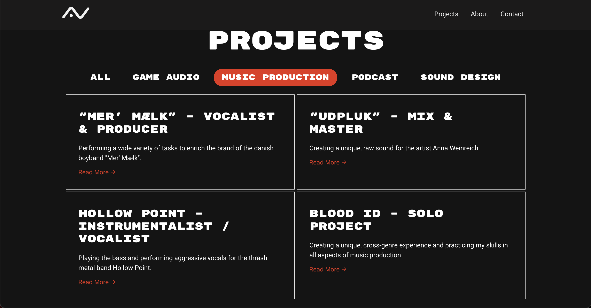

## About the project

A fellow student from UC SYD came to me with the wish to have a portfolio to showcase his work. He requested a website that showcased his personality but also made it possible for him to add content or edit things himself in the future.

Found @ https://avlyd.dk/

### Technologies used

- Wordpress
- Elementor

## My role

As I worked on this project alone, I was the responsible for all of the work, including:

- Collection of material and information from client
- Designing and planning structure and information architecture
- Creating the Wordpress site
- Deploying the website
- Handing it over and ensuring that the client is knowledgeable and comfortable managing the site

## The outcome

The client was satisfied with the product and felt that it was a great representation of his straightforward and slightly edgy personality.
  
Through this project I practiced being the sole responsible, which meant managing my own time, fixing my own mistakes and taking accountability where it was needed.
