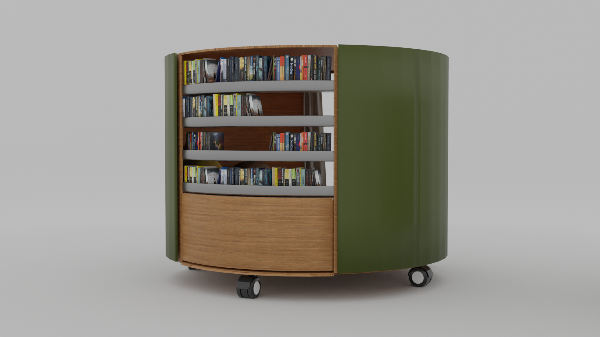
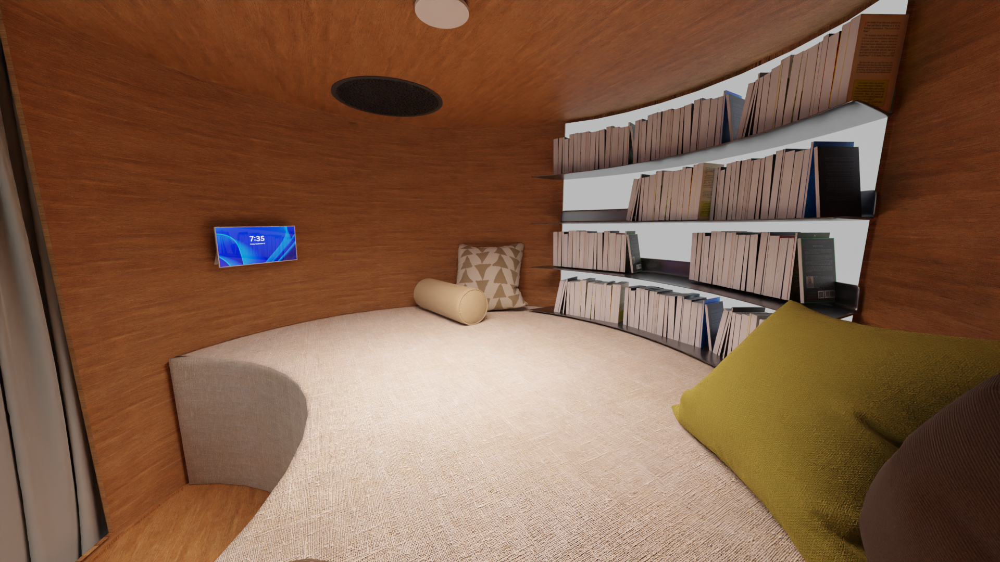
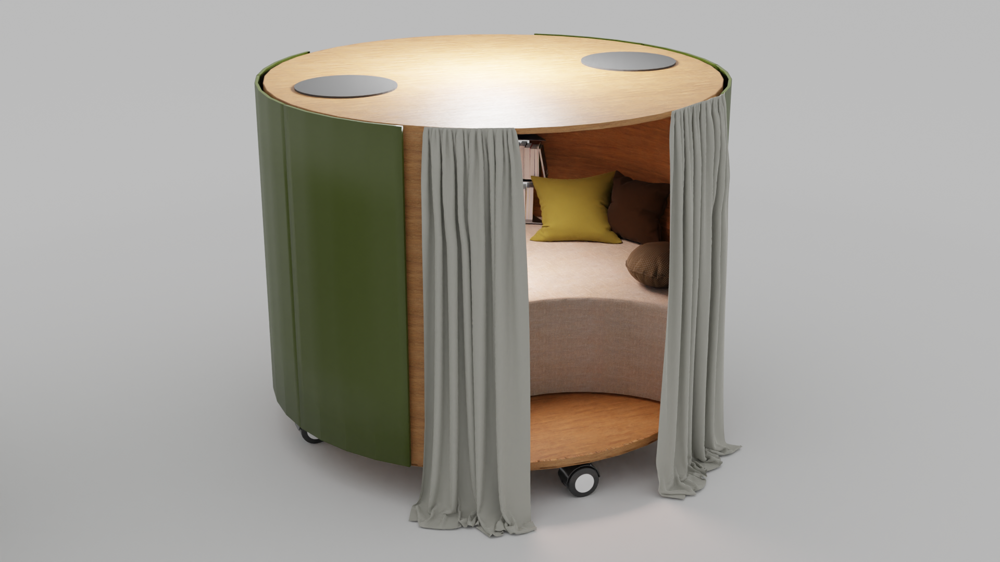

## About the project

I collaborated with fellow students from UC SYD, who were working on a concept to create an immersive environment in Kolding Library. They focused on designing furniture pieces that would encapsulate the reader and play different types of ambience music. I was asked to create visualizations for this.

