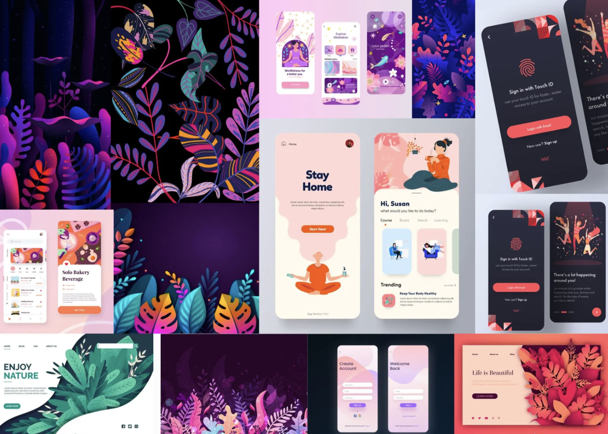
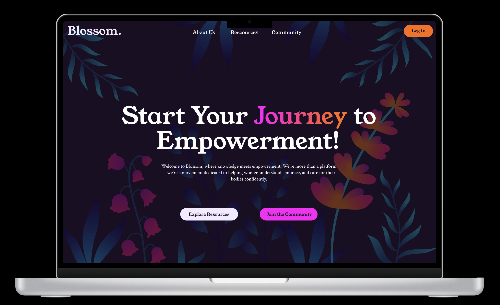
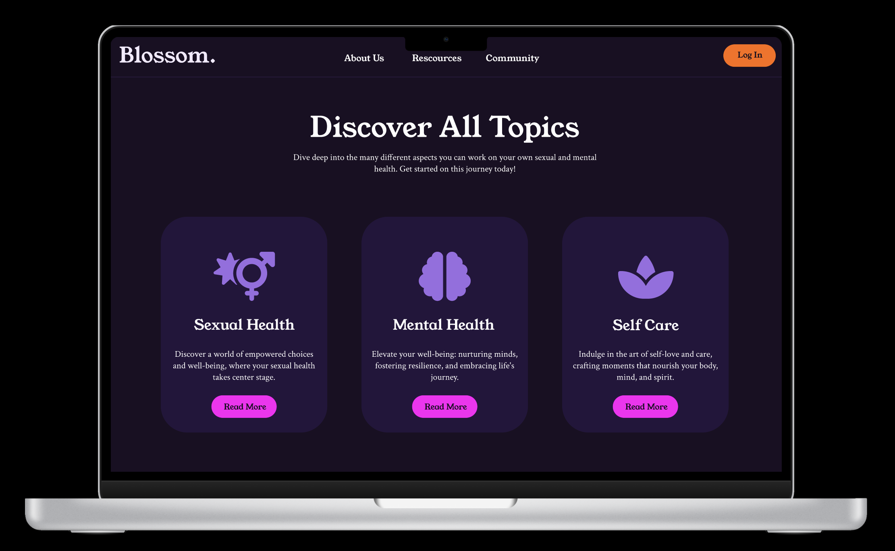

## About the project

This was a one day project, where I made a concept and webdesign for an imaginary female wellness business, Blossom. I prompted AI to give me a company description and client requirements, and delivered a web design/branding proposition based on these.

