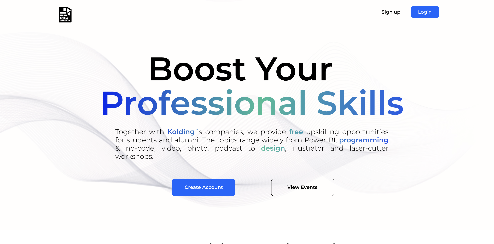
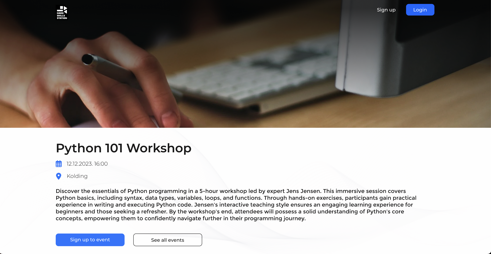
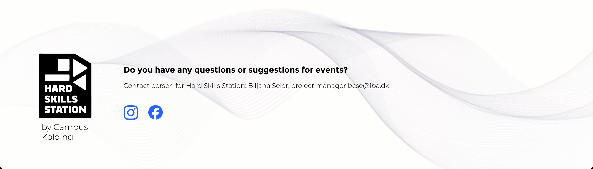

## About the project

This was a group project done in collaboration with IT architect students. We were to create a platform for Hard Skills Station, an organization that offers free courses, events and workshops for Campus Kolding students.
  
They required a simple design and a custom API to fetch events form an external event site and display them.
Me and a fellow student were responsible for creating the frontend, while the IT architect students created the custom API calls.
  
Demo @ https://hss.mathias-ulrich.dk/
 
_(Due to technical limitations outside of my control, the events aren't currently being displayed on the site.)_
  
Repo @ https://github.com/Hard-Skills-Station-website/Hard-Skills-Station-website

### Technologies used

- HTML
- CSS
- JavaScript

## My role

I was responsible for the following:

- Project management (division of tasks, time management)
- Wireframing structure and layout
- Aesthetic choices such as colors, icons, background etc.
- Development of the website using HTML, CSS, JavaScript
- Implementing dark/light theme
- Implementing a language switcher

## The outcome

The product was overall appreciated and taken into consideration for real life use.
  
I gained substantial knowledge on working interdisciplinarily with other students. I gained experience designing a clean, minimalistic website that appeals to a wide range of audiences. I gained more knowledge of working with responsive design as well.
