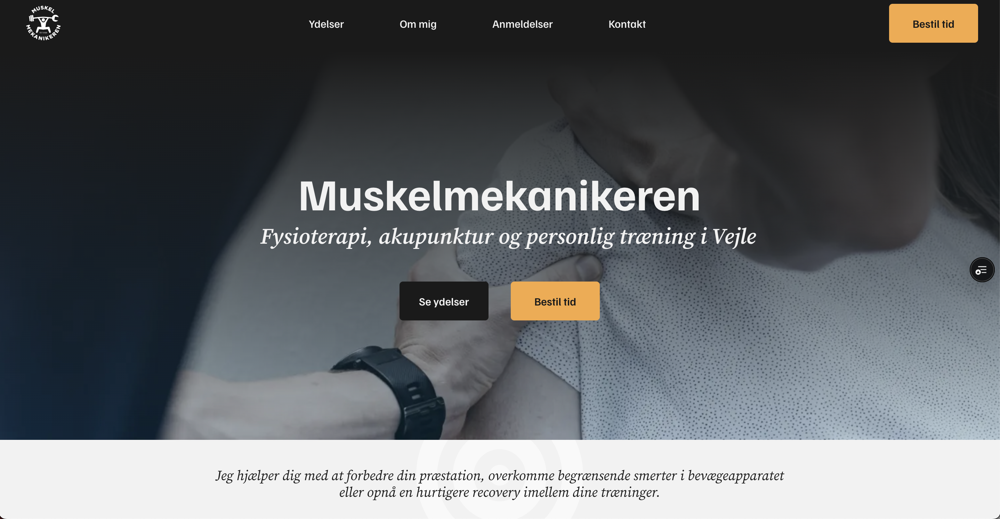

## About the project

This solo project was about creating a platform for Dennis Okholm, who owns the small business Muskelmekanikeren. My job was to create a minimalistic platform where he can showcase his work in an authentic way and offer information to potential clients.

Demo @ https://muskelmekanikeren.vercel.app/

Repo @ https://github.com/radclim/bachelor

### Technologies used

- Nuxt.js
- UnoCSS

## My role

This was my final project to finish my web development course, which meant I wanted to touch upon all aspects of creating a website. This meant the following tasks:

- Project management
- Company and target group research
- Improving existing and creating new company material
- Defining company branding
- Wireframing and designing the website
- Coding the website using Nuxt.js and UnoCSS (as per my internship company's standards)

## The outcome

Dennis was satisfied with the outcome and is planning to use a further improved version of the website for his company. Improvements would include slight adjustments to the design, adding subtle micro interactions and adding more of his own pictures.
  
I got to practice going through the entire process of creating a business website, including all areas.
