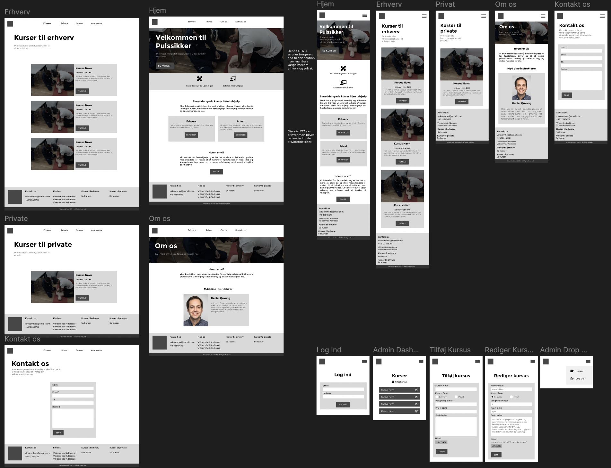

## About the project

This group exam project was about developing a headless CMS system for Daniel Quvang's first aid educator business.
The system needed to have a secure login system, and needed to offer the possibility for the admin to create, read, update and delete the courses offered on the website.
  
Repo @ https://github.com/Eksamensprojekt-PBW/pulssikker

### Technologies used

- EJS
- JavaScript
- CSS
- Express.js
- MongoDB

## My role

I was responsible for the following:

- Design of structure, layout, and aesthetics
- Setting up EJS file system
- CRUD functionality for courses and instructors
- Connecting the application to MongoDB
- Assisting the creation and fixing API calls to MongoDB
- Ensuring application security with the use of encryption (bcrypt)
- Implementation of alerts/action confirmation for better user experience

## The outcome

The final product functions great and can be deemed safe, as it uses safe encryption and got tested against OWASP security vulnerabilities.
  
With some additional time, we would've preferred to polish the design, implement more micro-interactions, animations and general aesthetic improvements.
  
We would've also liked to refactor some of the code and restructure the application. As this was our first time architecturally designing an application of this scope by ourselves, after finishing the project we got some great insights as to what could be better implemented next time.
